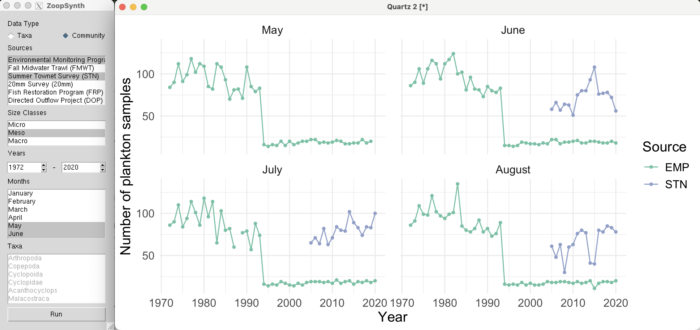
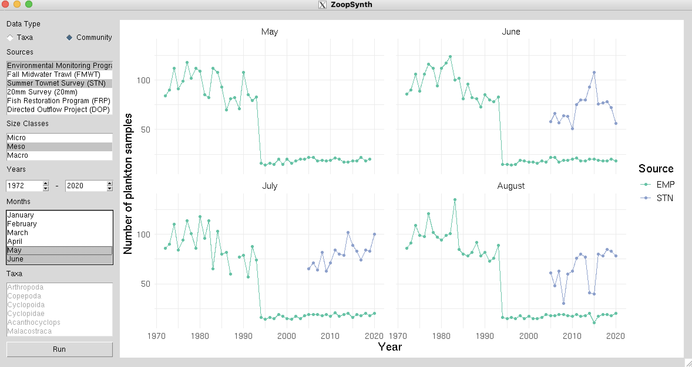

# ZoopSynth-tcltk

An attempt to reproduce **some** of the functionality in this [Shiny app](https://deltascience.shinyapps.io/ZoopSynth/) ([code](https://github.com/InteragencyEcologicalProgram/ZoopSynth/)) with [tcltk](https://r-universe.dev/manuals/tcltk.html). The sole purpose is fun and learning. [Slides](https://www.travishinkelman.com/pdf/ZoopSynth-tcltk.pdf) from a presentation at [IEP Data Science PWT](https://interagencyecologicalprogram.github.io/DataScience/) meeting.

There are two versions that share most of their code. One version (app.R) uses R's graphics window for plotting and the other version (app_tkrplot.R) embeds the plot in the application using the [tkrplot package](https://cran.r-project.org/web/packages/tkrplot/index.html). The tkrplot version works on macOS and Linux, but, on Windows, the plot does not fill the frame.

### R graphics window version

### tkrplot version
